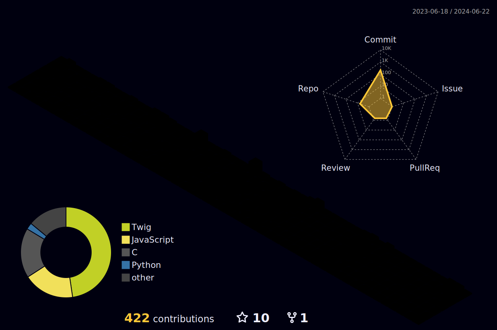

# Hello  ladies and gentlemen !

## ❔ About me

 

I'm Altaks, a 19 yo. french student who's learning programming languages in order to get a **Back end Developer** status. I'm specializing myself in **back-end** languages such as Java, Python and C/C++.

 

 

I enjoy learning about everything, especially about algorithms, optimization techniques, maths, physics and everything that concerns our world.
I'm looking forward to learn Rust and Kotlin to get a better understanding of the newest technologies.

## 🛠️ Current skills

## 🏅 Achievements

🎓 I got to partipate to the CGL (a national programming contest) of april 2022.

😄 I also participated to the "Nuit de l'info" twice (2022 and 2023 editions), a national coding competition going on at night (16 hours of non-stop coding, awesome !) .

## 📫 Contact me

<svg xmlns="http://www.w3.org/2000/svg" width="18" height="18" viewBox="0 0 24 24" style="fill: rgba(255, 255, 255, 1);transform: ;msFilter:;"><path d="M20 4H4c-1.103 0-2 .897-2 2v12c0 1.103.897 2 2 2h16c1.103 0 2-.897 2-2V6c0-1.103-.897-2-2-2zm0 2v.511l-8 6.223-8-6.222V6h16zM4 18V9.044l7.386 5.745a.994.994 0 0 0 1.228 0L20 9.044 20.002 18H4z"></path></svg> - <a mailto="altair61.dev@gmail.com">altair61.dev@gmail.com</a>

<svg xmlns="http://www.w3.org/2000/svg" width="18" height="18" viewBox="0 0 24 24" style="fill: rgba(255, 255, 255, 1);transform: ;msFilter:;"><path d="M14.82 4.26a10.14 10.14 0 0 0-.53 1.1 14.66 14.66 0 0 0-4.58 0 10.14 10.14 0 0 0-.53-1.1 16 16 0 0 0-4.13 1.3 17.33 17.33 0 0 0-3 11.59 16.6 16.6 0 0 0 5.07 2.59A12.89 12.89 0 0 0 8.23 18a9.65 9.65 0 0 1-1.71-.83 3.39 3.39 0 0 0 .42-.33 11.66 11.66 0 0 0 10.12 0q.21.18.42.33a10.84 10.84 0 0 1-1.71.84 12.41 12.41 0 0 0 1.08 1.78 16.44 16.44 0 0 0 5.06-2.59 17.22 17.22 0 0 0-3-11.59 16.09 16.09 0 0 0-4.09-1.35zM8.68 14.81a1.94 1.94 0 0 1-1.8-2 1.93 1.93 0 0 1 1.8-2 1.93 1.93 0 0 1 1.8 2 1.93 1.93 0 0 1-1.8 2zm6.64 0a1.94 1.94 0 0 1-1.8-2 1.93 1.93 0 0 1 1.8-2 1.92 1.92 0 0 1 1.8 2 1.92 1.92 0 0 1-1.8 2z"></path></svg> - altakxs
